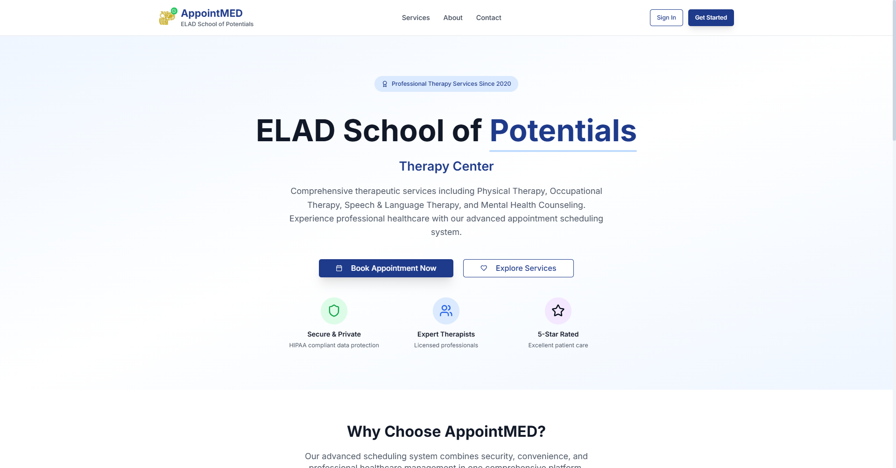

## Project Information

**[Project Technical Documentation](https://drive.google.com/file/d/1duZPLeUfBSGG8Lkq1pIkDqrryg4kzIKJ/view?usp=drive_link)**

### Key Members:
- **Project Manager**: Jhon Benrick Tasic
- **Documenter/Tester**: Shaira Mae Buhay
- **System Analyst**: Nicole Teñoso
- **System Admin**: Elay Gargarita
- **Developer/s**: Chuckie Española, Elijah Mariano

### Tech Stack
- **Frontend**: Next.js 14+ (App Router)
- **Styling**: Tailwind CSS
- **UI Components**: shadcn/ui
- **Authentication**: NextAuth.js with Google Provider
- **Database**: Firebase Firestore
- **Forms**: React Hook Form + Zod validation
- **Calendar**: React Big Calendar
- **Notifications**: React Hot Toast
- **Charts**: Recharts (for analytics)

## Core Features

### 1. User Authentication Module
- **Sign-up/Sign-in System**
- **Email Verification**
- **Google OAuth Integration**
- **User Profile Management**

### 2. Online Appointment Scheduling
- **Real-time Calendar View**
- **Available Time Slot Display**
- **Appointment Booking Interface**
- **Appointment Modification/Cancellation**
- **Service Type Selection**

### 3. Admin Dashboard Module
- **User Management (CRUD Operations)**
- **Appointment Management**
- **Calendar View & Management**
- **Analytics Dashboard**
  - User visit rates
  - Appointment statistics
  - Service category breakdown (pie charts)
- **Reporting System**

### 4. Automated Reminder System
- **Account-based Notifications**
- **Appointment Reminders**
- **Status Update Notifications**

### 5. User-Friendly Interface
- **Intuitive Navigation**
- **Responsive Design**
- **Confirmation Dialogs**
- **Visual Graphics/Icons**
- **Progress Indicators**

### 6. Real-time Availability
- **Live Calendar Updates**
- **Instant Booking Confirmation**
- **Conflict Prevention**
- **Double-booking Prevention**

### User Types
1. **System Administrator**
   - System Maintenance & Updates
   - Data Management & Backup
   - Security Protocol Management

2. **System Managers**
   - Customer Service Management
   - Appointment Coordination
   - Issue Resolution
   - Reporting & Analytics
   - User Support

3. **System Users (Patients/Guardians)**
   - Account Creation & Management
   - Appointment Scheduling
   - Schedule Viewing
   - Appointment Modifications
   - Feedback Submission

### User Collection
- User ID, Name, Email, Phone
- Authentication Method (Email/Google)
- Verification Status
- Profile Information

### Appointments Collection
- Appointment ID, User ID
- Date, Time, Duration
- Service Type, Therapist/Doctor
- Status (Scheduled, Completed, Cancelled)
- Notes/Comments

### Services Collection
- Service ID, Name, Description
- Duration, Category (Major/Minor)
- Availability Status

### Admin Users Collection
- Admin ID, Name, Email, Role
- Permissions, Last Login

### Development Phases
1. **Phase 1**: Core authentication and user management
2. **Phase 2**: Appointment scheduling system
3. **Phase 3**: Admin dashboard and analytics
4. **Phase 4**: Automated reminders and notifications
5. **Phase 5**: Testing, optimization, and deployment

## Key Improvements

### Performance Enhancements
- Server-side rendering for better SEO
- Static generation for landing pages
- Image optimization
- Code splitting and lazy loading

### User Experience
- Progressive Web App (PWA) capabilities
- Offline functionality
- Push notifications
- Mobile-first responsive design

### Developer Experience
- TypeScript integration
- Better error handling
- Automated testing setup
- CI/CD pipeline compatibility

### Security Improvements
- CSRF protection
- Rate limiting
- Input validation and sanitization
- Secure session management

## Client Information
- **Company**: ELAD School of Potentials Therapy Center
- **Address**: Camerino St. Brgy Luciano, Trece Martires City, Cavite
- **Mobile**: 0947 429 5648
- **Email**: eladschoolofpotentials@yahoo.com
